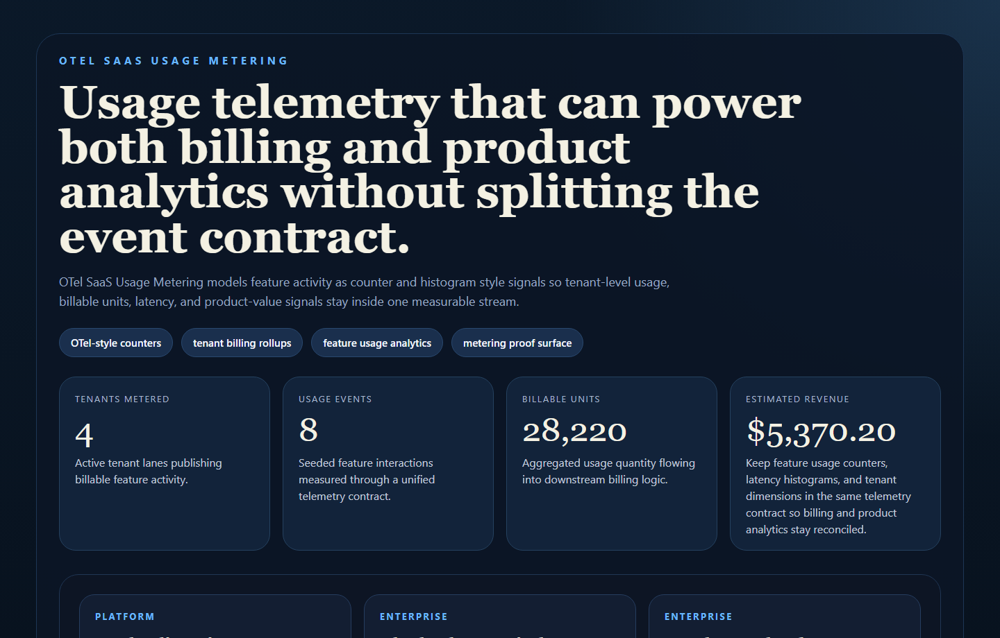
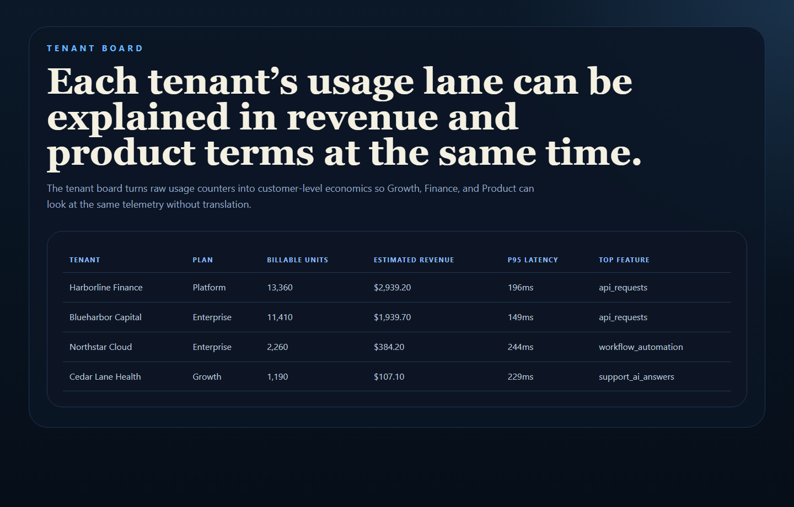
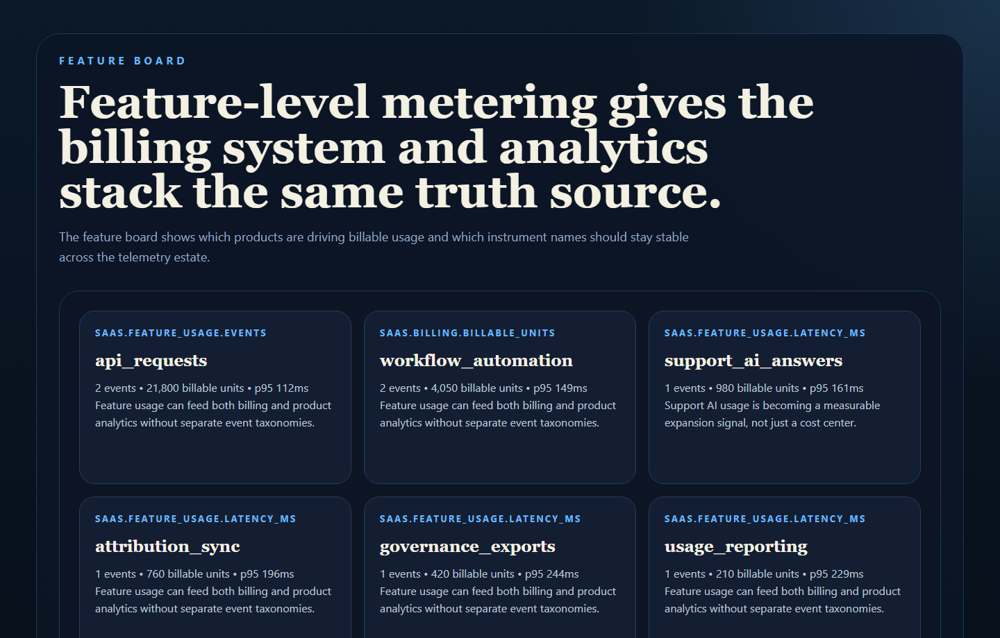
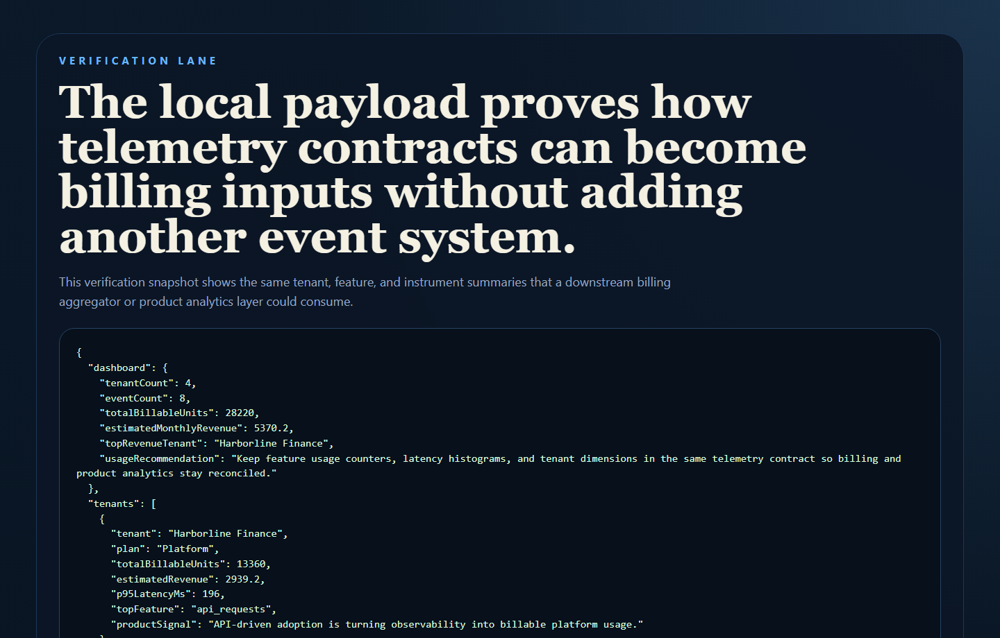

# OTel SaaS Usage Metering

OpenTelemetry-style SaaS usage metering for tenant feature activity, billable
aggregation, and product analytics reporting.

## Why This Repo Is Good

- It bridges product analytics and billing instead of treating them as separate systems.
- It turns feature usage into tenant-aware counters, histograms, and billable-unit summaries.
- It shows how OpenTelemetry naming and dimensions can support monetization logic.
- It fits well with SaaS economics, RevOps, and observability conversations.

## What It Ships

- TypeScript metering service
- seeded tenant usage event stream
- OTel-style counters and histogram naming
- billable unit and revenue rollups
- real PNG screenshots generated from live routes
- tests and CI

## Screenshots

### Overview



### Tenant Board



### Feature Board



### Verification



## Local Run

```powershell
Set-Location "C:\Users\chaus\dev\repos\otel-saas-usage-metering"
npm install
npm run dev
```

Open:

- [http://127.0.0.1:4672/](http://127.0.0.1:4672/)
- [http://127.0.0.1:4672/tenants](http://127.0.0.1:4672/tenants)
- [http://127.0.0.1:4672/features](http://127.0.0.1:4672/features)
- [http://127.0.0.1:4672/docs](http://127.0.0.1:4672/docs)

If that port is occupied:

```powershell
$env:PORT = "4678"
npm run dev
```

## Validation

```powershell
Set-Location "C:\Users\chaus\dev\repos\otel-saas-usage-metering"
npm run verify
powershell -ExecutionPolicy Bypass -File .\scripts\render_readme_assets.ps1
```

## API Routes

- `GET /api/dashboard/summary`
- `GET /api/tenants`
- `GET /api/features`
- `GET /api/events`
- `GET /api/instruments`
- `GET /api/sample`

## Repo Layout

- `src/app.ts`
- `src/services/meteringService.ts`
- `src/services/render.ts`
- `src/data/sampleUsage.ts`
- `scripts/render_readme_assets.ps1`

## Why It Matters

SaaS teams increasingly want one usage contract that can feed:

- billing
- tenant health
- feature adoption analysis
- product-led growth expansion signals
- observability cost conversations

That’s the gap this repo is designed to show.
